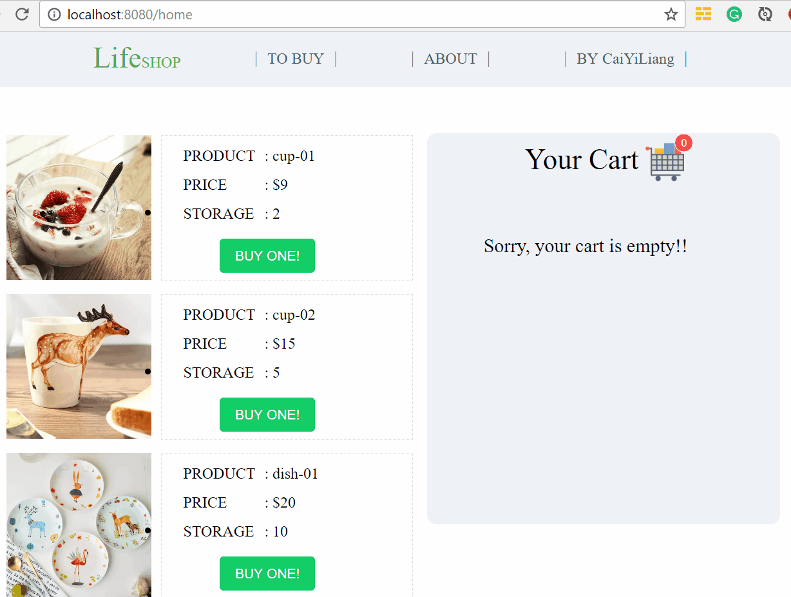

# vue-vuex-shoppingcart

> 利用**vue2.0,vuex,vue-router**实现简单页面<br>
> A shopping cart built with **vue2.x ,vue-router,vue-cli(webpack) and Element-UI**<br>
>
> -When you select/delete items you want to buy , the merchandise inventory account and the bill will change accordingly<br>
> 

# demo
<div text-align:center></div>

## Build Setup

``` bash
# install dependencies
npm install

# serve with hot reload at localhost:8080
npm run dev

# build for production with minification
npm run build

```

For detailed explanation on how things work, checkout the [guide](http://vuejs-templates.github.io/webpack/) and [docs for vue-loader](http://vuejs.github.io/vue-loader).

#todo item
- optimize the demo with vue-router 
- optimize the demo with vue-transition effect  <br>

~(≧▽≦)/~  如果有那么一丁点儿喜欢 请随手🌟~(≧▽≦)/~啦啦啦 <br>
~(≧▽≦)/~  Encourage me a start🌟 if you like it~(≧▽≦)/